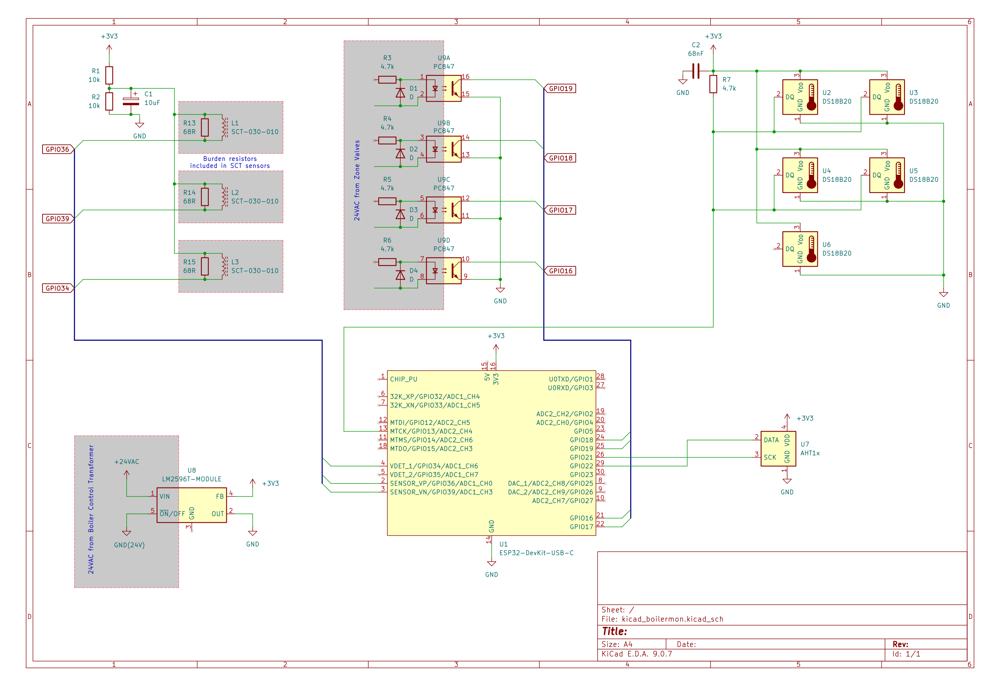

# boilermon
ESP32 sketch for remotely monitoring hot water boiler with ESPHome and Home Assistant.

## Background
After a boiler lockout because of a frozen air intake and an ice cold building, I started doing my research on temperature alerts so this didn't happen again. I was frustrated by the cost of the Lochinvar CON-X-US module and installation/setup for a boiler at a remote building, and figured that I only needed to know some basic information about the state of the system rather than get complete electronic control.

The screen on my boiler tells me certain system temperatures and the pump status. I figured I could get the same details unintrusively, as well as other zone-specific information that the boiler doesn't know about.

I wanted to use the electricity available nearby, so I included an ACDC converter (LM2596T) to provide 3.3v for the electronics from 24VAC, which powers the valves and thermostats. The module claims to handle sources up to 40VAC, so the HV variant is not necessary. A dedicated 3.3v source is recommended in any case, since I was getting brownout reboot loops when powering everything and also turning on wifi when using the onboard regulator.

The setup is written to monitor three motors (boiler, circulator, and domestic hot water); six temperatures (DHW tank, boiler water inlet, boiler water outlet/loop, boiler room ambient, air intake/outdoor ambient, exhaust); and four zone valves (with a quad optocoupler module). The ESP32 has plenty of ADC connections if you need to add motors, and you can certainly add more optocouplers for more zones. 

## BOM
* 1x ESP32 (I used an ESP-WROOM-32 DevKitC)
* 3x 10A CT clamps (SCT-013-010)
* 5x DS18B20 dallas one-wire temp sensor probes
* 1x AHT10 module
* 1x PC817 quad optocoupler
* 1x ACDC converter module (I used LM2596T-ADJ) (or provide your own 3v3 source)
* 5x 4.7k resistors
* 2x 10k resistors
* 1x 10uF capacitor
* 1x 68nF capacitor
* 4x diodes (I used 1N4148)
* 3.5mm TRRS jacks (optional, for the CT clamps)
* Basics (wire, protoboard, soldering iron, yadda yadda)

## Setup


I used this pinout:

```
GPIO36 - Boiler pump CT
GPIO39 - Circulator pump CT
GPIO34 - DHW pump CT

GPIO16 - Zone 1 optocoupler
GPIO18 - Zone 2 optocoupler
GPIO19 - Zone 3 optocoupler
GPIO17 - Zone 4 optocoupler

GPIO13 - DS one-wire input

SCL/GPIO21 - I2C SCL
SDA/GPIO22 - I2C SDA
```

Initially I ignored information about not using GPIO0/2 as input and used them because they were handily placed. Don't fall into that trap :)

When bench testing, think about recording the addresses for your one-wire temp sensors, so that you can differentiate their inputs in home assistant later.

The reverse diodes across the optocouplers are there to let the AC go somewhere on its negative sine wave, and the series resistors lower the current draw for the optocoupler, so we dont short circuit the zone valves. The PC817 is not specifically designed for AC input, but the reverse diode should keep it safe, if a bit jittery. A full bridge rectifier and smoothing is overkill; we debounce on the ESP input anyhow.

While we're there, make sure the ground planes are isolated across the PC817 module by removing the jumpers.

It is a good plan to test and adjust your variable ACDC converter, if used, to make sure it outputs 3.3v before connecting it to anything. If you want to keep it from accidentally changing, swap out your pot for a static resistor once you have it's value.

## Installation

WARNING: If you don't know what you're doing around mains electricity, contact an adult.

1. Shut down your boiler and turn off it's breaker switch, since we will be getting at the pump wires. They're insulated, but better to be safe. Also make sure your 24VAC transformer is shut down too (it ought be on the same circuit).
2. Open the junction boxes for the pump motors and clamp a CT around either of the pump wires (not the ground wire).
3. Use pipe wrap insulation and some aluminum tape to place the temperature sensors on their respective pipes. I wanted to monitor boiler in/out, DHW tank out, and the inlet/exhaust air temperatures.
4. Connect wires from each zone valve to the input of the optocouplers, making sure to add the series resistors.
5. Hook up your ACDC converter to the AC side, make sure it is still adjusted to the right output voltage, and then connect it to the rest of the board.
6. Turn on the power for the boiler and transformer, and monitor for explosions.
